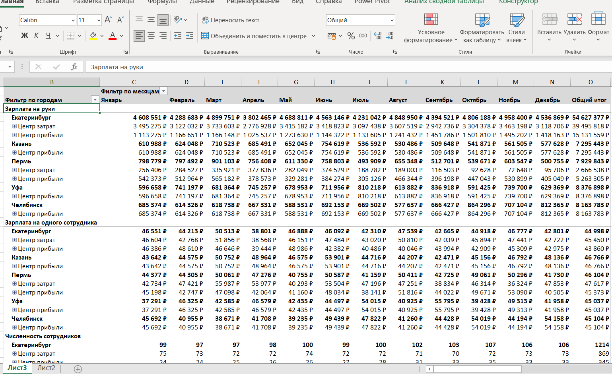
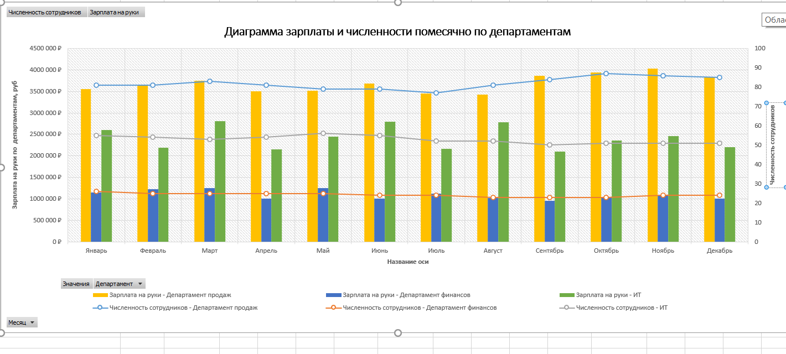

# Автоматизация зарплатной отчётности

## Стек:

  &nbsp;
  &nbsp;
  ;  

## Описание:

Проект направлен на автоматизацию расчёта и анализа зарплатной отчётности на основе данных о выплатах, численности персонала и организационной структуре компании.
Задача включала объединение данных из нескольких источников, построение модели данных и разработку интерактивной отчётности.

## Цель проекта:

1. Автоматизировать формирование зарплатной отчётности; 
2. Обеспечить анализ фонда оплаты труда в разрезе подразделений, городов и месяцев; 
3. Повысить прозрачность данных и сократить время подготовки отчётов.
 
## Данные:

Файлы в папке «Зарплатные ведомости». Все файлы имеют одинаковую структуру: на листе «Лист»
находится диапазон, содержащий три столбца.
| Название поля     | Описание                         |
|---------------    |----------------------------------|
| Дата              | Первая дата месяца, когда выдана зарплата |
| Код подразделения | Трехчастный код подразделения. Части разделены точками. Каждая часть представляет собой число |
| Зарплата          | Сумма выданной зарплаты, включая подоходный налог |

Файл «Динамика численности и структура.xlsx». Содержит данные о структуре отделов предприятия и
участниках программы. В таблицах ниже указаны столбцы исходных таблиц и описание содержимого
каждого столбца.
| Название поля     | Описание                         |
|---------------    |----------------------------------|
|Код подразделения | Трехчастный код подразделения. Части разделены точками. Каждая часть представляет собой число | 
| Группа           | Штатное объединение первого уровня |
| Отдел            | Штатное объединение второго уровня. Разбивается на группы |
| Департамент      | Штатное объединение третьего уровня. Разбивается на отделы |
| Тип ЦО           | Тип ЦО: Центр прибыли (приносит деньги) или Центр затрат (только расходует деньги) |

Файл "География".
| Название поля     | Описание                         |
|---------------    |----------------------------------|
| Код города        | Цифровой код региона нахождения филиала. Совпадает с кодами в названиях файлов в папке "Зарплатные ведомости" | 
| Город             | Название города |

Файл "Численность персонала" - представляет собой матрицу.

## Что сделано:

1. Реализован ETL-процесс в Power Query (объединение файлов, очистка данных) 
2. Построена модель данных в Power Pivot 
3. Рассчитаны ключевые метрики: 
    ◦ зарплата "на руки" 
    ◦ зарплата на сотрудника 
    ◦ доля подразделений в ФОТ 
4. Реализована аналитическая отчётность: 
    ◦ матрицы по подразделениям и городам 
    ◦ динамика зарплат 
    ◦ структура затрат 
5. Добавлены фильтры и визуализация

## Результаты:

1. Автоматизирован расчёт зарплатной отчётности; 
2. Сокращено время подготовки отчётов (ручной расчёт - автоматический); 
3. Повышена прозрачность структуры затрат; 
4. Обеспечена возможность быстрого анализа данных по различным разрезам.

## Примеры отчётов:

.png)
.png)
